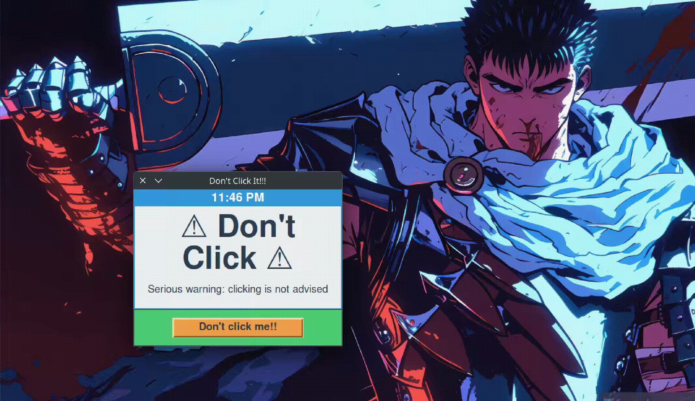

# Every Click Counts 👆


**Description**:  
"Don't Click Me" is a mysterious Python project with an intriguing name. This project is written in Python, leveraging modules like `tkinter` for GUI and `pyarmor` for obfuscation. It is packaged into standalone executables for macOS, Windows, and Linux using `pyinstaller`.

---



---

## Table of Contents
- [Builds](#builds)
- [Requirements](#requirements)
- [Setting Up a Virtual Environment](#setting-up-a-virtual-environment)
- [Installation Guide](#installation-guide)
  - [MacOS](#macos)
  - [Windows](#windows)
  - [Linux](#linux)
- [Dependency Management](#dependency-management)
- [Included Modules](#included-modules)
- [Obfuscation with PyArmor](#obfuscation-with-pyarmor)
- [File Arrangement](#file-arrangement)
- [Contributing](#contributing)
- [License](#license)

---
## Builds:
```
Install the ELF for Linux:
```
From Here:- [Linux ELF](https://www.dropbox.com/scl/fi/smxp8sif4muocxmjy921b/clicks?rlkey=ekjlmxhn9pkgtvqo2357i9pux&st=69n4eddc&dl=0)

```
Install the EXE for Windows:
```
From Here:- [Windows EXE]()

```
Install the .App for MacOs:
```
From Here:- [MacOs .App]()


---
## Requirements
Before you begin, ensure you have the following installed:
- Python 3.7 or higher
- pip (Python's package manager)
- pyinstaller (for creating standalone executable files)
- pyarmor (for obfuscating the Python code, optional)

Install `pyinstaller` and `pyarmor` using pip:
```bash
pip install pyinstaller pyarmor
```

---

## Setting Up a Virtual Environment
It is recommended to use a virtual environment to isolate your dependencies and avoid conflicts with global Python installations.

1. Create a virtual environment:
   ```bash
   python -m venv venv
   ```

2. Activate the virtual environment:
   - On macOS/Linux:
     ```bash
     source venv/bin/activate
     ```
   - On Windows:
     ```cmd
     venv\Scripts\activate
     ```

3. Once activated, you will see `(venv)` in your terminal prompt.

4. Install the required dependencies:
   ```bash
   pip install -r requirements.txt
   ```

5. To deactivate the virtual environment when done:
   ```bash
   deactivate
   ```

---

## Installation Guide
Follow the steps below to create a standalone executable for your platform using `pyinstaller`.

---

### macOS
1. Activate the virtual environment (if you haven’t already):
   ```bash
   source venv/bin/activate
   ```

2. Navigate to the directory containing your Python script:
   ```bash
   cd src
   ```

3. Create a standalone executable:
   ```bash
   pyinstaller --onefile --name YourAppName --icon=youricon.icns --add-data "path_to_data" --hidden-import=PIL._tkinter_finder path_to_script.py
   ```
   Use .icns for icon on macos,

   like
   ```bash
   pyinstaller --onefile --name Clicks --icon=icons/noClick.icns --add-data "animation.gif:." --hidden-import=PIL._tkinter_finder process.py
   ```

   use: and the end of the path to your additional data, refer to the installation for Linux to know more.

 
5. The standalone executable will be located in the `dist` folder.

6. Run the executable:
   ```bash
   ./dist/your_script
   ```

---

### Windows
1. Activate the virtual environment (if you haven’t already):
   ```cmd
   venv\Scripts\activate
   ```

2. Navigate to the directory containing your Python script:
   ```cmd
   cd src
   ```

3. Create a standalone executable:
   ```cmd
   pyinstaller --onefile --name YourAppName --icon=youricon.ico --add-data "path_to_data" --hidden-import=PIL._tkinter_finder path_to_script.py
   ```
  For Windows use, instead of : and add the location of your images, GIFS, vids here.

   like
   ```cmd
   pyinstaller --onefile --name clicks --icon=icons/noClick.ico --add-data "animation.gif;." --hidden-import=PIL._tkinter_finder process.py
   ```

4. The standalone executable will be located in the `dist` folder.

5. Run the executable:
   ```cmd
   dist\your_script.exe
   ```

---

### Linux
1. Activate the virtual environment (if you haven’t already):
   ```bash
   source venv/bin/activate
   ```

2. Navigate to the directory containing your Python script:
   ```bash
   cd src
   ```

3. Create a standalone executable:
   ```bash
   pyinstaller --onefile --name YourAppName --add-data "path_to_data" --hidden-import=PIL._tkinter_finder path_to_script.py
   ```
   For Windows use, instead of : and add the location of your images, GIFS, vids here.

   like
   ```bash
   pyinstaller --onefile --name clicks --add-data "animation.gif:." --hidden-import=PIL._tkinter_finder process.py
   ```

4. The standalone executable will be located in the `dist` folder.

5. Run the executable:
   ```bash
   ./dist/your_script
   ```

---

## Dependency Management
To manage dependencies:

1. After installing or updating any modules in your virtual environment, update your `requirements.txt` file:
   ```bash
   pip freeze > requirements.txt
   ```

2. Other developers can install the same dependencies using:
   ```bash
   pip install -r requirements.txt
   ```

---

## Included Modules

### `tkinter`
- **Purpose**: Provides a graphical user interface (GUI) for the application.
- **Details**: `tkinter` comes pre-installed with Python, so no additional installation is required.

### `pyarmor`
- **Purpose**: Used for obfuscating Python scripts for added security, ensuring the source code is harder to reverse-engineer.
- **Installation**:
  ```bash
  pip install pyarmor
  ```

---

## Obfuscation with PyArmor
To obfuscate your Python code with `pyarmor`:

1. Install `pyarmor` if you haven’t already:
   ```bash
   pip install pyarmor
   ```

2. Obfuscate your Python script:
   ```bash
   pyarmor pack -e " --onefile" -x " --exclude dist" src/your_script.py
   ```

3. The obfuscated and packaged executable will be in the `dist` folder.

---

## File Arrangement
To keep the repository organized and maintainable, the following directory structure is recommended:

```
Don-t-Click-Me/
├── README.md                   # Project description and instructions
├── requirements.txt            # List of dependencies (if any)
├── venv/                       # Virtual environment directory
├── src/                        # Source code files
│   └── your_script.py          # Main Python script
├── dist/                       # Output directory for pyinstaller executables
├── build/                      # Build directory created by pyinstaller
├── .gitignore                  # Files to ignore in Git
└── .github/
    ├── workflows/              # GitHub Actions workflows
    └── ISSUE_TEMPLATE/         # GitHub issue templates
```

### Explanation of Key Files and Directories
- **`README.md`**: Provides project details and setup instructions.
- **`requirements.txt`**: Specifies dependencies that can be installed with `pip install -r requirements.txt`.
- **`venv/`**: Contains the virtual environment files. Add this directory to `.gitignore` to avoid committing it to Git.
- **`src/`**: Contains the main Python script and any additional source files.
- **`dist/`**: Stores standalone executables generated by `pyinstaller`.
- **`build/`**: Temporary directory created during the build process.
- **`.gitignore`**: Ensures unnecessary files (e.g., `build/`, `dist/`, `.pyc` files) are not tracked by Git.

---

## Contributing
Contributions are welcome! If you'd like to contribute, please follow these steps:
1. Fork the repository.
2. Create a new branch (`git checkout -b feature-name`).
3. Make your changes.
4. Commit your changes (`git commit -m 'Add some feature'`).
5. Push to the branch (`git push origin feature-name`).
6. Open a pull request.

---

## License
This project is licensed under the MIT License. See the [LICENSE](LICENSE) file for details.

---

Let me know if you'd like further adjustments or additions!

Keep coding, peeps!


And don't be a Scrpit kiddie
